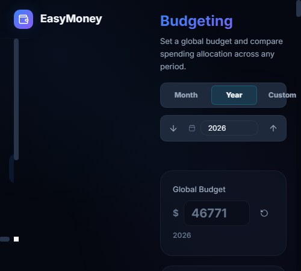
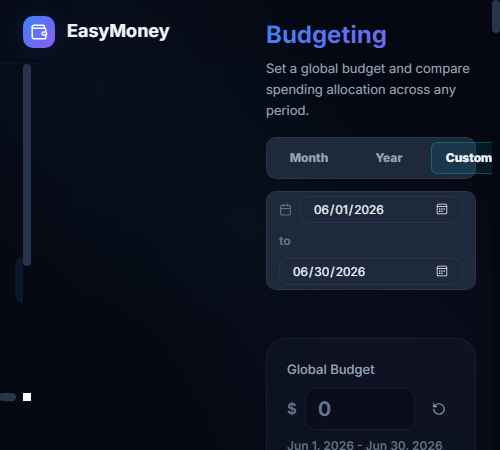

# EasyMoney

EasyMoney is a local-first personal finance dashboard for importing bank, credit card, and investment transactions from CSV files.

## Features

- Account, transaction, budget, net worth, and analytics views
- CSV import with bank/profile detection and manual column mapping
- Credit card transaction handling
- Duplicate detection for repeat imports
- Saved import profiles for repeated uploads with the same file format
- Local SQLite persistence through a small Express API

## Screenshots

### Budgeting

Track month, year, and custom-range budgets against actual spending.






### Mobile Budgeting

The budgeting workflow also adapts to smaller screens.


## Local Data

EasyMoney stores local app data in `data/easymoney.sqlite`. The `data/` folder is ignored by Git so personal transaction data is not committed.

## Development

```bash
npm install
npm run dev
```

The dev command starts both the API server and Vite frontend.

- Frontend: `http://localhost:5173`
- API: `http://localhost:4177`

## Build

```bash
npm run build
```
